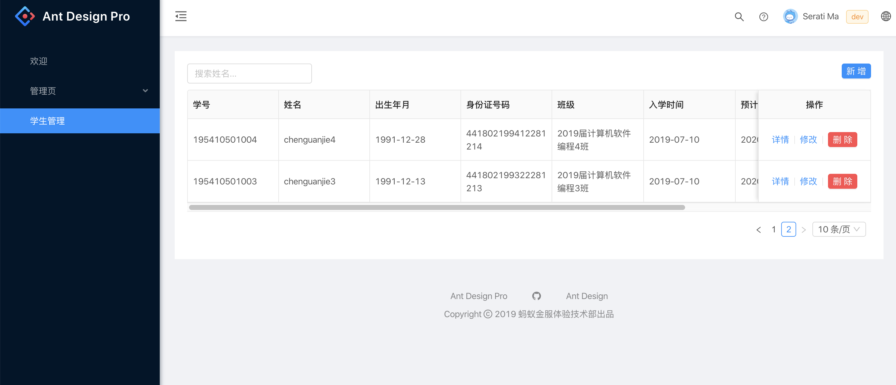

# Student Sytem Demo

> web with by umi.js , server use egg.js

# 安装依赖

```bash
// webapp install
cd web-app && npm install
// run
npm run dev

// server api install
cd  server-api && npm install
// run
npm run dev
```

## 安装数据库

1. 自行安装 mongodb
2. mac 安装

```bash
# 进入 /usr/local
cd /usr/local

# 下载
sudo curl -O https://fastdl.mongodb.org/osx/mongodb-osx-ssl-x86_64-4.0.9.tgz

# 解压
sudo tar -zxvf mongodb-osx-ssl-x86_64-4.0.9.tgz

# 重命名为 mongodb 目录
sudo mv mongodb-osx-x86_64-4.0.9/ mongodb

export PATH=/usr/local/mongodb/bin:$PATH

sudo mkdir -p /data/db

sudo mongod

# 如果没有创建全局路径 PATH，需要进入以下目录
cd /usr/local/mongodb/bin
sudo ./mongod
```

3. 创建数据库 student 数据库

4. 配置项目 mongodb 数据库地址

   ```javascript
   /server-api/cfgino / config.default.ts;

   config.mongoose = {
     client: {
       url: "mongodb://127.0.0.1:27017/student",
       options: {
         useUnifiedTopology: true
       }
     }
   };
   ```

# Preview


